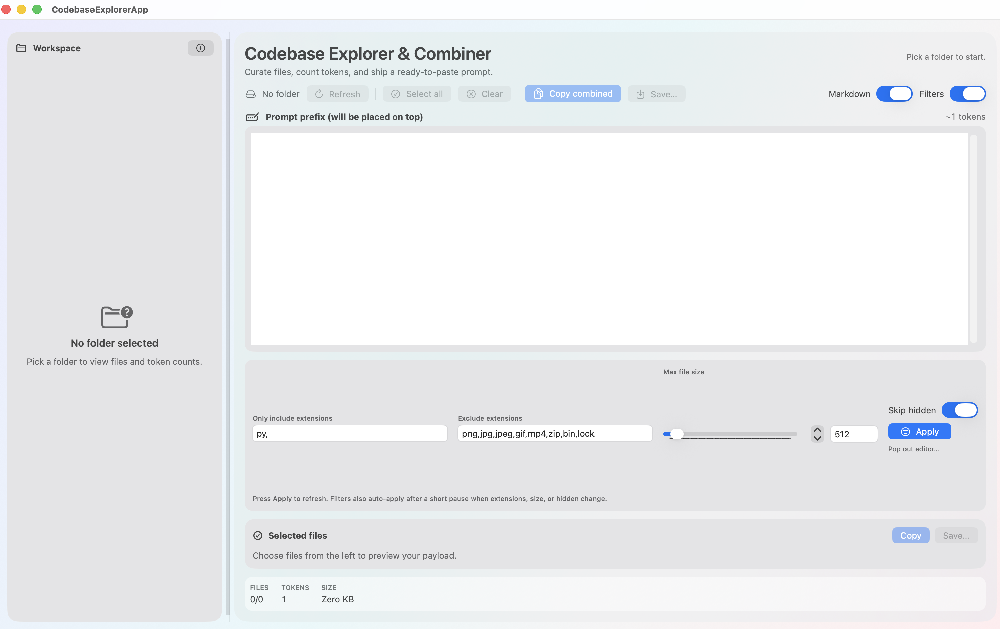

# Codebase Combiner

[](https://github.com/s1korrrr/codebase-combiner/actions/workflows/ci.yml)
[](LICENSE)

Codebase Combiner helps you curate files, count tokens, and generate a ready-to-paste prompt from a workspace or folder.

This repo ships two deliverables:

- VS Code extension (Node/JavaScript)
- macOS SwiftUI app (SwiftPM)

## Features

- Combine a workspace or folder into a single Markdown or text file.
- Flexible include/exclude filters by glob and extension.
- Token estimation for prompt sizing.
- SwiftUI desktop app for visual selection and preview.

## Preview



## Getting started

See `INSTALL.md` for full setup and run instructions.

Quick start (VS Code extension):

```sh
npm install
npm test
npm run package
```

Quick start (Swift app):

```sh
cd SwiftExplorerApp
swift run
```

## Usage

### VS Code extension

Commands:

- “Combine Workspace to Single File”
- “Combine This Folder to Single File” (context menu)

Output options are configurable in VS Code settings under “Codebase Combiner”.

### macOS SwiftUI app

- Launch with `swift run` (or run the built binary).
- Choose a folder, adjust filters, select files, and copy/save the combined prompt.

## Development

### JavaScript/Node

- Tests: `npm test`
- Lint: `npm run lint`
- Format: `npm run format` (or `npm run format:check` in CI)

### Swift

- Tests: `cd SwiftExplorerApp && swift test`
- Format (SwiftFormat): `swiftformat .`

## Quality gates

- JS: ESLint + Prettier + Mocha
- Swift: XCTest + SwiftFormat
- CI: GitHub Actions runs all quality gates on PRs

## Contributing

See `CONTRIBUTING.md`.

## Security

See `SECURITY.md`.

## License

MIT. See `LICENSE`.
