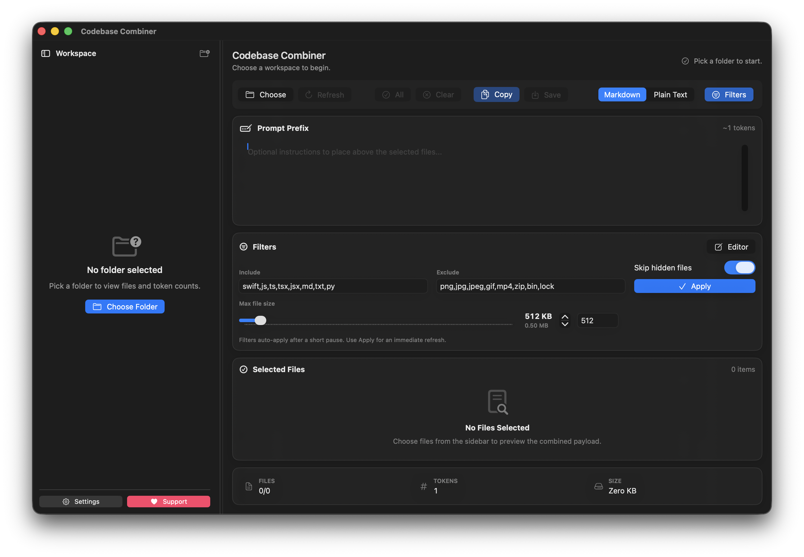

# Codebase Combiner

[](https://github.com/s1korrrr/codebase-combiner/actions/workflows/ci.yml)
[](LICENSE)

Codebase Combiner helps you curate files, count tokens, and generate a ready-to-paste prompt from a workspace or folder.

This repo ships two deliverables:

- VS Code extension (Node/JavaScript)
- Native macOS SwiftUI app (SwiftPM)

## Features

- Combine a workspace or folder into a single Markdown or text file.
- Flexible include/exclude filters by glob and extension.
- Token estimation for prompt sizing.
- Native macOS sidebar/detail app for visual file selection, prompt preview, and copy/save workflows.
- Animated loading, empty, selection, hover, and copy-feedback states with Reduce Motion support.
- macOS Settings for default output format, filters, hidden-file handling, and max file size.
- Support links in the app menu, Settings, and sidebar for [Buy Me a Coffee](https://buymeacoffee.com/s1korrrr).

## Preview



## Getting started

See `INSTALL.md` for full setup and run instructions.

Quick start (VS Code extension):

```sh
npm install
npm test
npm run package
```

Quick start (Swift app):

```sh
cd SwiftExplorerApp
swift run CodebaseExplorerApp
```

## Usage

### VS Code extension

Commands:

- “Combine Workspace to Single File”
- “Combine This Folder to Single File” (context menu)

Output options are configurable in VS Code settings under “Codebase Combiner”.

### macOS SwiftUI app

- Launch with `swift run CodebaseExplorerApp` from `SwiftExplorerApp/`.
- Choose a folder, adjust filters, select files, then copy or save the combined prompt.
- Use the sidebar footer or macOS app menu for Settings and support actions.
- Settings persist scan/output defaults through `@AppStorage`.

## Development

### JavaScript/Node

- Tests: `npm test`
- Lint: `npm run lint`
- Format: `npm run format` (or `npm run format:check` in CI)

### Swift

- Build: `cd SwiftExplorerApp && swift build`
- Tests: `cd SwiftExplorerApp && swift test`
- Run: `cd SwiftExplorerApp && swift run CodebaseExplorerApp`
- Format (SwiftFormat): `cd SwiftExplorerApp && swiftformat .`
- Format check: `cd SwiftExplorerApp && swiftformat --lint .`

### Mac App Store packaging

- Local bundle validation: `Packaging/AppStore/build_app_store_package.sh --skip-signing`
- App Store signing/package flow: see `Packaging/AppStore/README.md`
- Output directory: `dist/app-store/`

## Quality gates

- JS: ESLint + Prettier + Mocha
- Swift: XCTest + SwiftFormat
- CI: GitHub Actions runs all quality gates on PRs

## Contributing

See `CONTRIBUTING.md`.

## Security

See `SECURITY.md`.

## License

MIT. See `LICENSE`.
